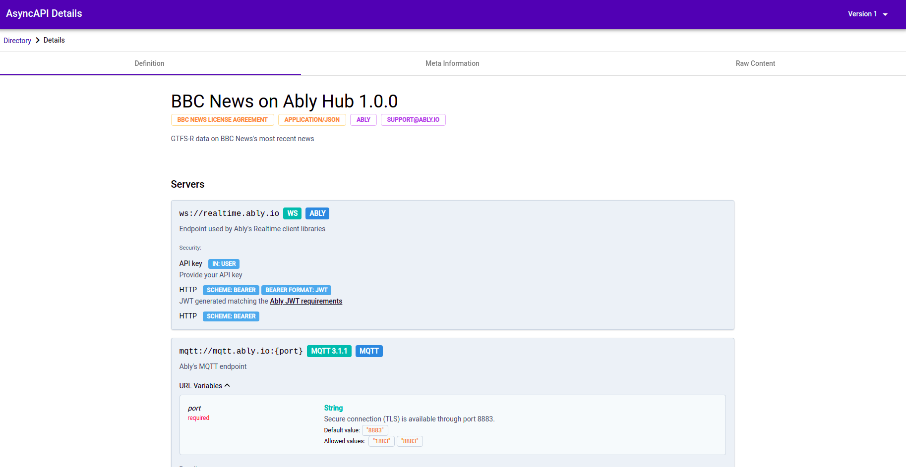

:toc:
:toc-title:
:toclevels: 2
:sectnums:
= AsyncAPI Directory

In large IT application landscapes, several teams usually work together. Several applications offer their interfaces to the outside world. Documenting these interfaces appropriately and making them available can become a challenge as the size of the IT infrastructure grows. For asynchronous applications in particular, new documentation requirements arise that could not previously be met by https://swagger.io/specification/[OpenAPI] (which has already established itself for synchronous applications). AsyncAPI has created a new possibility for this.

This project implements a prototype for the central provision of AsyncAPI definitions. For example, the AsyncAPI Directory could be used as follows: +
Multiple teams developing different applications deploy their AsyncAPI definition so that it is stored in a Kafka Topic. The AsyncAPI Directory server lists all AsyncAPI definitions from this topic, including older versions. The development teams can view the corresponding AsyncAPI if needed and develop their application against it.

This idea of an API registry is already offered by https://www.apicur.io/[Apicurio]. However, since AsyncAPI is still a new standard, Apicurio does not yet provide a way to represent the AsyncAPI definitions in a human-readable way. https://github.com/Apicurio/apicurio-studio/issues/447[Work is in progress to fully support AsyncAPI].

While this prototype uses only Kafka as a data store, other storage options are possible. For example, the AsyncAPI definitions could also be stored in a relational database.

Developing new applications on a "contract first" basis offers several advantages, such as decoupling development processes across multiple teams. The provided AsyncAPI definitions could be used to create mockup services using a code generation tool, as already offered by https://microcks.io/[Microcks].

== Quick Start

. Start Kafka components using the cluster-setup script. The script will start the Docker containers and create the _asyncapi_ topic:
+
----
./cluster-setup.sh
----

. Start KafkaApplication locally. Afterwards, its REST API will be accessible via port 8080.
. Publish some testing data of AsyncAPI definitions:
+
----
./test-data.sh
----

. Compile and start the Angular application:
+
----
cd ./asyncapi-ui
npm install
npm install --save @asyncapi/react-component@next
ng serve
----

. Navigate to http://localhost:4200.

== Preview

== Structure of this Prototype
This prototype uses the https://github.com/asyncapi/asyncapi-react[AsyncAPI React component]* that can be embedded within Angular applications. This makes the rendered AsyncAPI definitions look like what is offered by the https://www.asyncapi.com/[Playground]. +
The backend is written Kafka Spring, the frontend uses Angular. As soon as a new AsyncAPI definition is written into Kafka,
the server will consume the new definition and add it to its in-memory storage.

*Components:*

* *Kafka Broker*: the AsyncAPI definitions are stored within a Kafka topic
* *Backend server*: listens for new definitions on the Kafka topic, caches them in-memory and offers a REST API
* *Frontend application*: gets the AsyncAPI definitions from the server via REST calls; uses the AsyncAPI React component for rendering

*Remark: At the moment, the React component is re-written in the https://github.com/asyncapi/asyncapi-react/tree/next[next-branch]. Since this branch contains all the new features, this prototype uses
the component from there.

== Server REST API
The AsyncAPI server adds, gets and processes AsyncAPI definitions from Kafka. The REST API of the server provides some basic operations that are used by the Angular frontend application. Details about the endpoints can be found within the link:asyncapi-server-api.yaml[API documentation] which was written using OpenAPI/Swagger.

== Defining AsyncAPIs
=== Custom Extensions

Nearly every object within an AsyncAPI definition can be extended with https://www.asyncapi.com/docs/specifications/v2.0.0#specificationExtensions[specification extensions]:

* definition of new fields by including an "x-" prefix
* the custom fields are currently not rendered by the React component!

=== Defining Kafka-Specific Properties with AsyncAPI
*Server Configuration* +
It is currently not possible to configure the Kafka Broker with Kafka-specific
bindings within an AsyncAPI definition. Kafka Topics are equivalent to AsyncAPI
Channels. Therefore, the channel names correspond to the Kafka topic names.
Additional properties, e.g. the number of partitions or replication factors, could be configured by using custom extensions like described in paragraph 3.1.

*Message Binding* +
The "bindings" property of the https://www.asyncapi.com/docs/specifications/v2.0.0#messageObject[message object] can be used to define keys of Kafka messages.
Further details are provided https://github.com/asyncapi/bindings/tree/master/kafka[here].
Since "key" is defined to be a https://www.asyncapi.com/docs/specifications/v2.0.0#schemaObject[Schema Object], various additional properties can be specified and referenced.

*Operation Binding* +
The "bindings" property can also be applied to the https://www.asyncapi.com/docs/specifications/v2.0.0#operationObject[operation object].
It can be used to define the _groupId_ and the _clientId_ of the consumer/producer.
Since _groupId_ and _clientId_ are as well defined as https://www.asyncapi.com/docs/specifications/v2.0.0#schemaObject[Schema Objects], they could also be more complex than simple strings.

== Official Extensions and Functionalities in Development
There are some official extensions and functionalities that are currently developed by the AsyncAPI Team. Some interesting projects are:

*Diff Library* +
The https://github.com/asyncapi/diff[diff library] is in an early stage of development and aims to enable comparison and compatibility of API changes.

*AsyncAPI Studio* +
https://github.com/asyncapi/studio[Studio] is currently in an early stage of development and wants to offer an editor (similar to the playground) and potentially some other functionalities (?).

*Modelina* +
https://github.com/asyncapi/modelina[Modelina] is as well in an early stage of development.
It did not reach version 1.0.0 yet and therefore, breaking changes  are still possible.
Modelina SDK wants to enable generation of data models from JSON and AsyncAPI definitions.
